

  <h1>👨‍💻 Olá, eu sou o Carlos Silva</h1>
  <h3>Desenvolvedor Full Stack | Estudante de Engenharia de Software</h3>
  
📍 Jaraguá do Sul - SC, Brasil

  
  

 

## 🚀 Sobre mim

Sempre tive a curiosidade de desmontar o mundo para entender como as engrenagens rodam, e foi exatamente essa mentalidade investigativa que me trouxe para a área da tecnologia.

Venho de uma sólida experiência prática no ambiente industrial da **WEG**, onde desenvolvi alta disciplina, organização cirúrgica e foco em resolução rápida de problemas reais. Hoje, aplico essa base na Engenharia de Software e no desenvolvimento web Full Stack, construindo soluções eficientes e arquiteturas limpas que facilitam o dia a dia das empresas e das pessoas.

Fora do código, mantenho uma rotina ativa com corrida e musculação. O esporte me ensina diariamente sobre consistência, resiliência e foco no longo prazo características que levo diretamente para a tela do computador ao debugar um código complexo ou aprender uma nova tecnologia.

Atualmente, desenvolvo aplicações modernas do zero ao deploy em produção (SaaS/PWA) e busco minha primeira oportunidade oficial como Desenvolvedor Júnior, pronto para agregar valor e escalar projetos com a equipe.

---

## 🛠️ Tecnologias e Habilidades

### 💻 Front-end & Design

  
  
  
  
  
  

### ⚙️ Back-end & BaaS (Backend as a Service)

  
  
  
  
  

### 🔧 Ferramentas, Arquitetura & APIs

  
  
  
  
  

---

## 🔥 Projetos em Destaque

### 1️⃣ Ponto Seguro — SaaS/PWA de Controle de Jornada de Trabalho
**Em produção** ·   [📂 Repositório](https://github.com/Carlos-xiruu/app_ponto)

  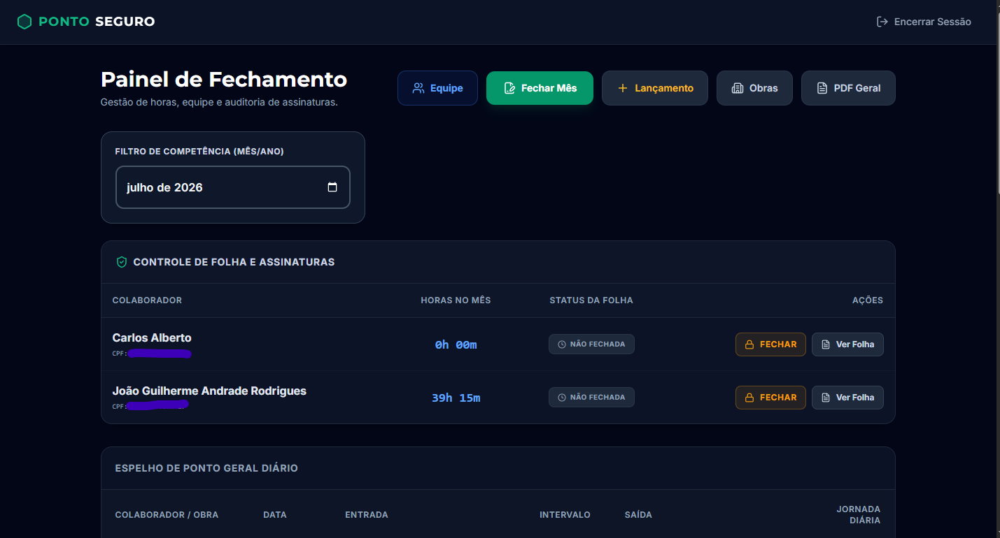
  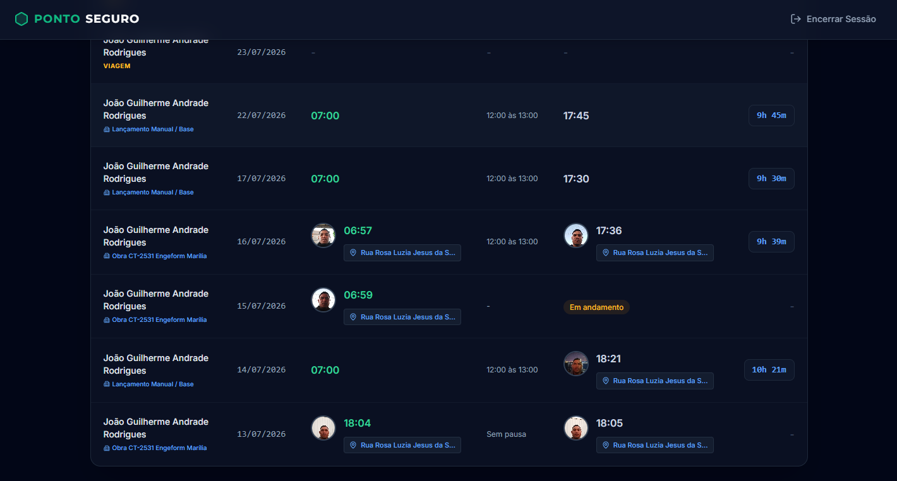

  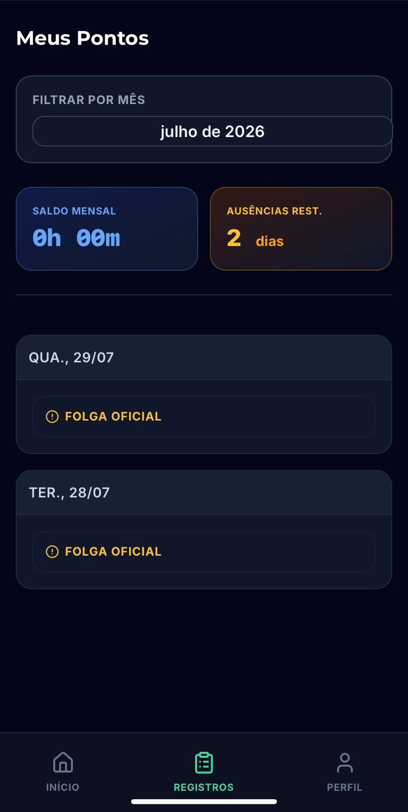
  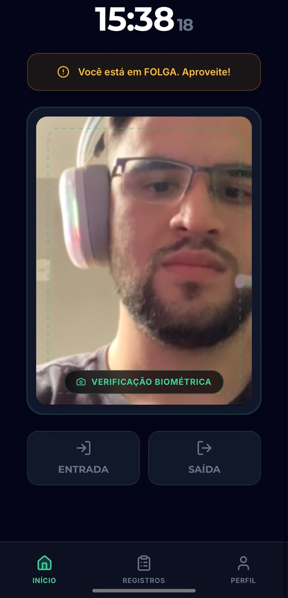

Sistema que substitui relógios de ponto físicos, trazendo segurança jurídica (Lei 14.063/2020) e auditoria para o RH.

- **Geofencing (Cerca Eletrônica):** Fórmula de Haversine para bloquear batidas de ponto fora do raio da obra
- **Assinatura Digital:** Criptografia SHA-256 com rastreabilidade de IP e GPS para fechamento mensal
- **Autenticação e RLS:** Banco de dados seguro com Supabase (PostgreSQL) e Row Level Security

`React` `TypeScript` `Supabase` `PostgreSQL` `PWA`

---

### 2️⃣ Diário de Obra — Digitalização de Registro de Obras

**Em produção**  · [📂 Repositório](https://github.com/Carlos-xiruu/diario-de-obras)

App que digitaliza o registro diário de obras de montagem de pré-moldados, substituindo o antigo controle manual em folha impressa.

Antes vs. Depois

 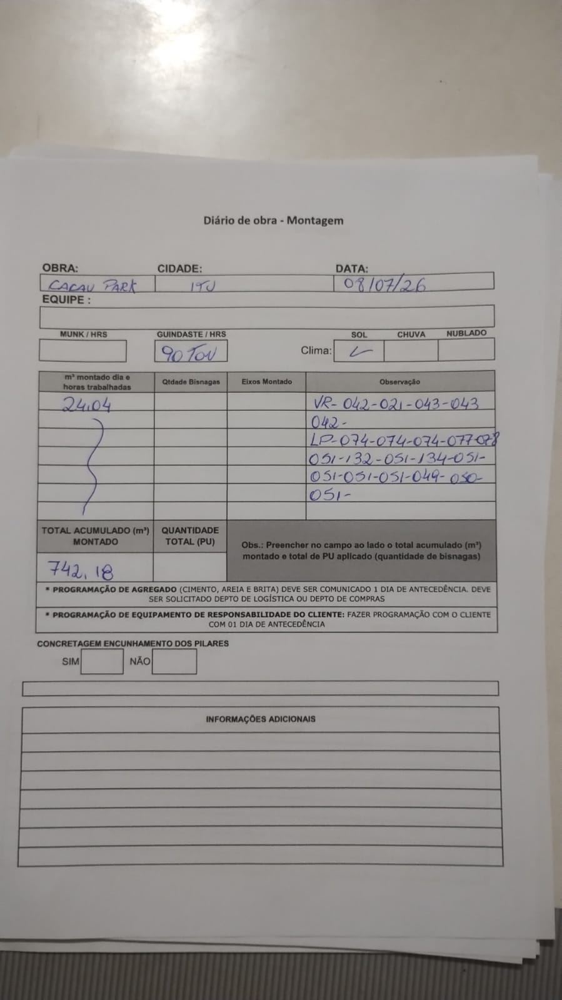 
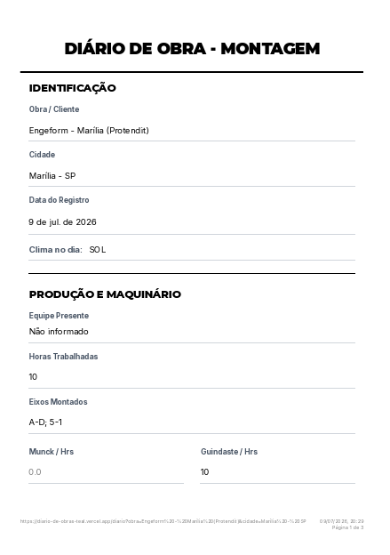 
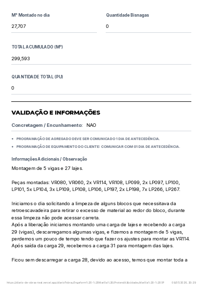
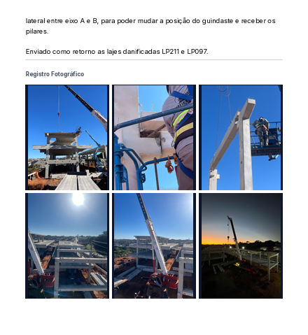
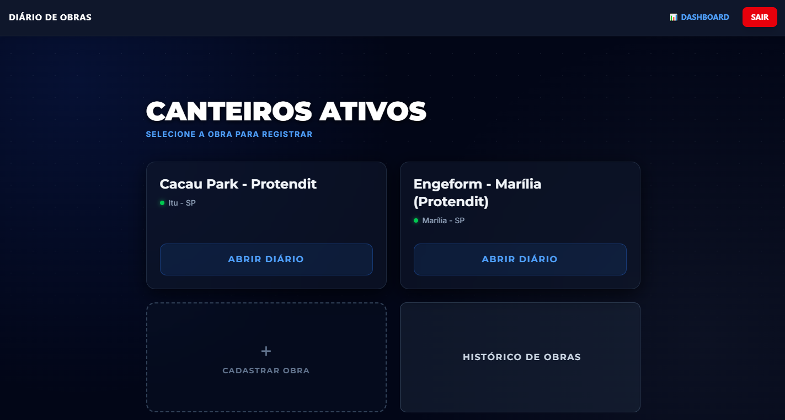
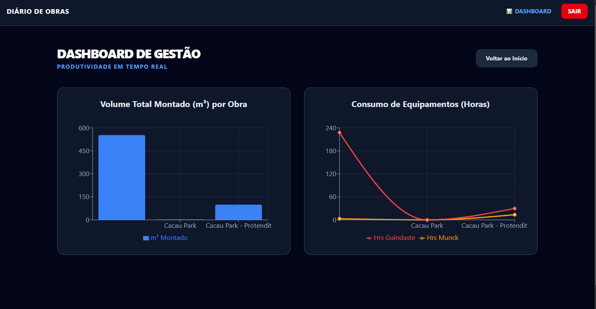

 
<i>À esquerda, o registro em papel usado antes do sistema. À direita, os mesmos dados hoje digitalizados em pdf gerado diretamente do app e visualizados em dashboard.</i>

Fluxo de preenchimento do diário

 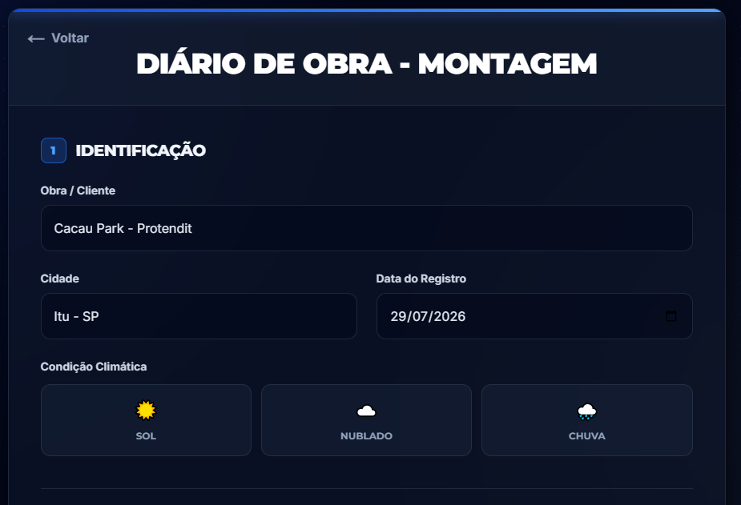 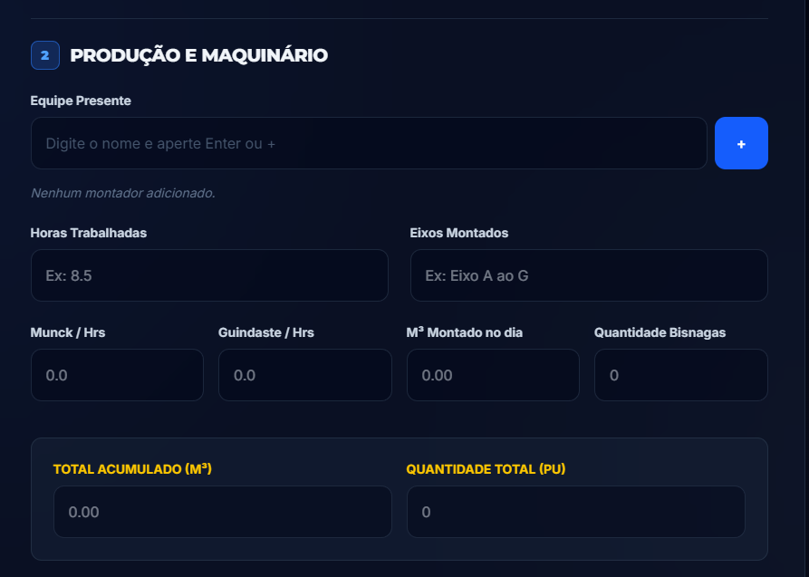 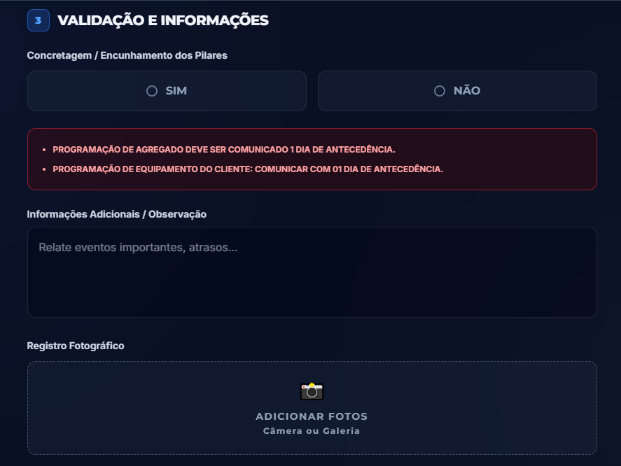 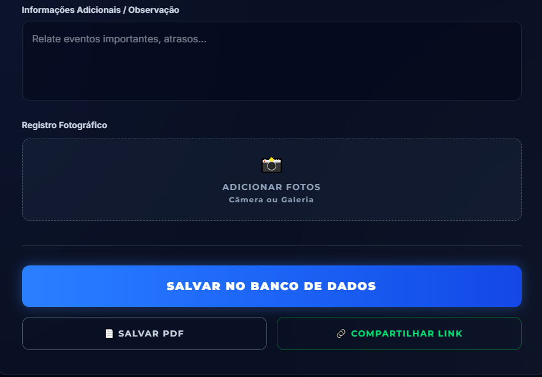 

Fluxo guiado em 3 etapas (identificação, produção/maquinário, validação), fiel ao formulário físico que substituiu
Registro fotográfico anexado a cada entrada, direto da câmera ou galeria
Dashboard com gráficos de volume montado e consumo de equipamentos por obra
Exportação em PDF e compartilhamento por link
Elimina retrabalho e perda de informação do processo em papel

`React` `TypeScript` `Supabase` `PostgreSQL` `PWA`

---

### 3️⃣ AgendaPHP — Sistema de Agendamento
[📂 Repositório](https://github.com/Carlos-xiruu/agenda-php)

<!-- 📸 Insira aqui um print da tela de agendamento -->

Sistema de agendamento funcional construído do zero como projeto de portfólio, com foco em fundamentos sólidos de back-end.

- Conexões via PDO e operações CRUD completas
- Dropdowns dinâmicos e modo escuro customizado em CSS
- Resolução de conflitos reais de branch (master vs. main) durante o desenvolvimento

`PHP` `MySQL` `CSS`

---

## 🏭 Experiência Prévia

**WEG** — Mecânico de Manutenção

- Rotinas de alta responsabilidade e precisão técnica
- Diagnóstico de falhas em máquinas complexas
- Trabalho em equipe multidisciplinar e adaptação a diferentes processos fabris

*Essa vivência forjou minha base em organização, disciplina e pensamento lógico estruturado — os mesmos pilares que hoje sustentam a arquitetura dos meus códigos e resoluções de bugs.*

---

## 🎯 Objetivo Profissional

Atuar como **Desenvolvedor Júnior** em um ambiente onde eu possa:
- Aplicar na prática meu stack tecnológico (React/TS/Supabase/PHP) e minha visão de negócios focada na entrega de valor ao cliente
- Aprender as melhores práticas com profissionais e engenheiros seniores
- Contribuir ativamente com código limpo, escalável e manutenível
- Iniciar uma trajetória de forte crescimento mútuo com a empresa

---

## 📊 GitHub Stats

  
  

